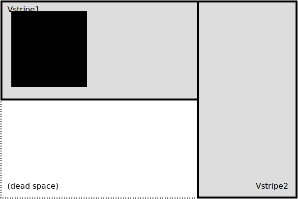

# RLayout

## Summary

The RLayout code came in as part of the support for the RandR X
extension, but isn't tied to RandR itself.  Rather, it's a generalized
scheme for describing and determining intersecting layouts of abstract
things.

In practice, most uses boil down to a description of the layout of your
monitor[s], and its functions are used to map windows onto them, figure
out which monitor[s] the window is on, and figure out what it would mean
to `f.*zoom` that window in various ways, either keeping it on a single
monitor or crossing multiple.

This document attempts to give an overview of the pieces defined in the
various `r_area*.[ch]` and `r_layout.[ch]` files.  There is fairly
extensive documentation in Doxygen comments on the structures and
functions (x-ref <<doxygen.adoc,Doxygen bits>> in this manual for how to
build and use them), as well as fairly extensive narrative comments
through the code.  This document won't attempt to cover all those sort of
details, but rather to give a high level view of the goals of the code.

## Data Structures

### RArea

`RArea` defines an area of space, given by X/Y coordinates, and
width/height extents.  In the global layout sense, each monitor is
represented by an RArea giving its position on the whole desktop space.
When positioning or sizing windows, an (emphemeral) `RArea` is created
defining the window's size/position, to be used by the various
`RArea*()` or `RLayout*()` functions.

### RAreaList

`RAreaList` is just a container for a set of ``RArea``'s.  It's used
anywhere we need to build or pass around lists of ``RArea``'s.  Commonly
these will involve monitors.  _e.g._, the list of all your monitors is an
`RAreaList`, as would be the result of asking "`Which monitor[s] is this
window being displayed on?`", etc.

### RLayout

`RLayout` is used to hold derived attributes of an `RAreaList`.  This
generally means "`the layout of your monitors`".  It holds the list of
monitors, and also separately (if your setup provides such) the list of
output names provided by RandR, which can be used to set the geometry
of things like icon managers in an output-relative way.

It also contains pre-built ``RAreaList``'s of all the rectangular
horizontal and vertical stripes that make up the space covered by the
union of your monitors.  This is used in calculating horizontal and
vertical ``f.zoom``'s of windows, so they cover the maximum available
space without stretching outside the area covered by monitors.  This is
important when your monitor setup doesn't make a single rectangle
(_e.g._, you have 2 monitors with different resolutions).

## Examples

Let's consider an example layout.

